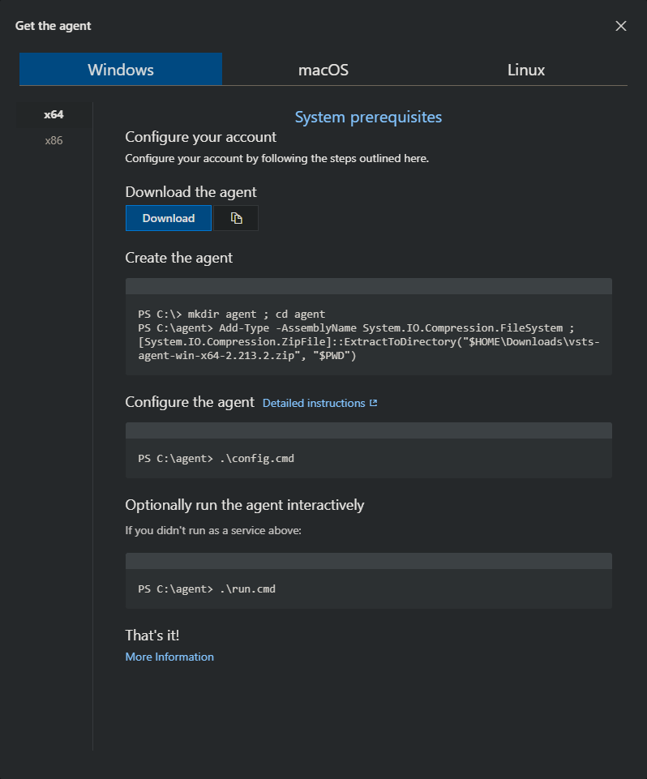

[[_TOC_]]

# Introduction

Welcome to use ATE test automation built top of Robot Framework.

The goal of these tools are to provide easy way to develop and run automated tests for products manufactured by Epec Oy.

The following chapters describes what tools are used to build ATE test automation.

More information about the ATE architecture can be found from [README](docs/README.md) located in **docs** folder.

# Azure DevOps

[Azure DevOps](https://learn.microsoft.com/en-us/azure/devops/?view=azure-devops) supports a collaborative culture and set of processes that bring together developers, project managers, and contributors to develop software.
It allows organizations to create and improve products at a faster pace than they can with traditional software development approaches.

**More information about Azure tools used in ATE:**

- [Azure DevOps](https://learn.microsoft.com/en-us/azure/devops/?view=azure-devops)
- [Azure Boards](https://learn.microsoft.com/en-us/azure/devops/boards/?view=azure-devops)
- [Azure Pipelines](https://learn.microsoft.com/en-us/azure/devops/pipelines/?view=azure-devops)
- [Azure Repositories](https://learn.microsoft.com/en-us/azure/devops/repos/?view=azure-devops)

# Robot Framework

[Robot Framework](https://robotframework.org/) is a generic open source automation framework.
It can be used for test automation and robotic process automation (RPA). Robot Framework is supported by Robot Framework Foundation.
Many industry-leading companies use the tool in their software development.

Robot Framework is open and extensible.
Robot Framework can be integrated with virtually any other tool to create powerful and flexible automation solutions.
Robot Framework is free to use without licensing costs.

Robot Framework has an easy syntax, utilizing human-readable keywords.
Its capabilities can be extended by libraries implemented with Python, Java or many other programming languages.
Robot Framework has a rich ecosystem around it, consisting of libraries and tools that are developed as separate projects.

**Please remember when reading Robot Framework documentation to check what's the Robot Framework version in use.**

# Python

[Python](https://www.python.org/) is a high-level, general-purpose programming language. Its design philosophy emphasizes code readability with the use of significant indentation.

Python is dynamically typed and garbage-collected. It supports multiple programming paradigms, including structured (particularly procedural), object-oriented and functional programming. It is often described as a "batteries included" language due to its comprehensive standard library.

**Please remember when reading Python documentation to check what's the Python version in use.**

## Python style guide

ATE repository uses a custom style for Python that is aligned towards Robot Framework usage. For more information please read the Python styleguide for this repository:

[Python Style Guide](docs/PYTHON_STYLEGUIDE.md).

## Python virtual environment

[venv](https://packaging.python.org/en/latest/guides/installing-using-pip-and-virtual-environments/#creating-a-virtual-environment) (for Python 3) allow to manage separate package installations for different projects.
It essentially allow you to create a “virtual” isolated Python installation and install packages into that virtual installation.
When you switch projects, you can simply create a new virtual environment and not have to worry about breaking the packages installed in the other environments.
It is always recommended to use a virtual environment while developing Python applications.

To make virtual environment creation/activation/deactivation/removal easy there are batch scripts in the root of ATE workspace.

- **setup_virtual_env.bat**
  - Setups virtual environment (venv)
  - Installs all necessary pip packages from requirements.txt
- **remove_virtual_env.bat**
  - Removes virtual environment (venv)


# National Intruments

[National Instrument](https://www.ni.com/en.html)'s [PXI](https://www.ni.com/en/shop/pxi.html) is a computer for test engineers. It is a test and measurement platform that combines a controller with measurement instruments in a multi-slot chassis. Engineers use NI PXI to build high-performance, mixed-measurement systems for validation and production test.

NI created PXI to be an open standard for test hardware. PXI is now a leading industry standard for automated test with more than 60 vendors offering specialty modules.

## Veristand

[VeriStand](https://www.ni.com/en/shop/data-acquisition-and-control/application-software-for-data-acquisition-and-control-category/what-is-veristand.html) software validates hardware and performs embedded software test for hardware-in-the-loop applications. Accelerate the product development lifecycle with model integration, real-time stimulus generation, and an extensible software environment.

VeriStand software validates hardware and performs embedded software test for hardware-in-the-loop applications. Accelerate the product development lifecycle with model integration, real-time stimulus generation, and an extensible software environment.

- Import simulation models and control algorithms
- Configure alarms and respond to events
- Automate tests with ASAM XIL, TestStand, .NET, and other software
- Add custom functionality with LabVIEW, C/C++, Python, and more


# Tools and versions

Currenlty the following version of tools are supported.

## Python 3.10.11

Can be downloaded from here: [LINK](https://www.python.org/downloads/release/python-31011/)

**Reason not to use latest Python version?**

*Python.NET ([pythonnet]([pythonnet](http://pythonnet.github.io/))) is currently compatible and tested with Python releases 3.7 - 3.11.*

## PIP Packages and installation

The Python Package Index, or [PyPI](https://pypi.org/), is a vast repository of open-source Python packages supplied by the worldwide community of Python developers. The official index is available at https://pypi.org, and the site itself is maintained by the Python Software Foundation.

In the root of the ATE folder there's requirements.txt file which lists all PIP required packages with the corresponding version. User can install these python PIP packages for ATE with the following command typing following command in the root of ATE folder:

```
pip install -r requirements.txt
```

# Azure agent

To build your code or deploy your software using Azure Pipelines, you need at least one agent. As you add more code and people, you'll eventually need more. When your pipeline runs, the system begins one or more jobs. An agent is computing infrastructure with installed agent software that runs one job at a time. Azure Pipelines provides several different types of agents: Microsoft-hosted agent, Self-hosted agent and Azure Virtual Machine Scale Set agents.

When adding a new agent in agent pool in Azure the following dialog appears which guides the installation.



When download and extracting agent is done then configuration of azure agent can be done with the following command:

*.\config.cmd --unattended --url https://epectfssrv.ad.epec.fi/tfs --auth integrated --pool Testing --runAsService --agent AGENT_NAME*

# Known tips & tricks

When running azure pipeline on your agent it will automatically in checkout code phase when SSL certificate.

**Please note that this is highly insecure. You are disabling certificate validation.**

To disable check azure devops ssl certificate, go to a variable group your pipeline and add:

```
GIT_SSL_NO_VERIFY = 1
NODE_TLS_REJECT_UNAUTHORIZED = 0
```

When defining pipeline in YAML format you can define the following variable.

```
variables:
- name: GIT_SSL_NO_VERIFY
  value: 1
- name: NODE_TLS_REJECT_UNAUTHORIZED
  value: 0
```


