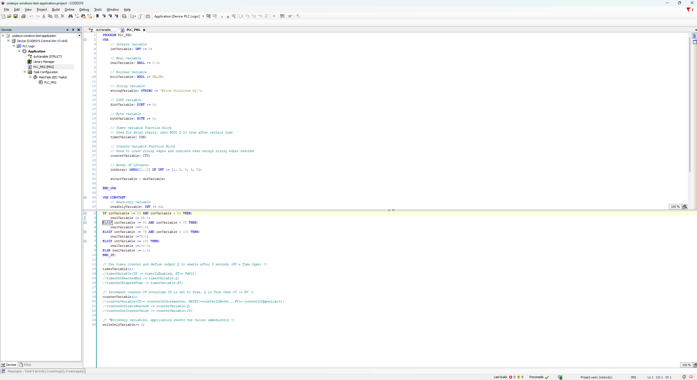

[[_TOC_]]

# Introduction

This folder contains [Codesys](https://www.codesys.com/) project **Codesys Win Test Application** which can be ran on Windows using windows based PLC emulator.

# Codesys installation

Codesys can be downloaded from EPEC network drive.

```
T:\RDProjects\Ohjelmistot\CoDeSys\
```

The easiest way to download Codesys is to run Download Codesys Powershell [script](../download_codesys.ps1).

Script will download Codesys installation packages to your Downloads folder.

# Codesys Control Win V3

CODESYS Control Win V3 is one of the configuration variants of CODESYS Control. It is appropriate for industrial PCs running Microsoft Windows without hard real-time demands or for testing purposes.

# Codesys Win Test Application

[Codesys Win Test Application](../codesys/Codesys%20Win%20Test%20Application//codesys-windows-test-application.project) is the project which is runnable on Windows without any hardware.

This is good way to get familiar with Codesys and also to test usage of the python interface called:

- [Codesys](../python_libs/interfaces/codesys)
- [Executers](../python_libs/utilities/codesys)

# Gateway

This [gateway](Gateway) contains CANOpen Gateway which is used to communicate with Codesys while using EPEC's products. Gateway is currently configured to work with Kvaser's USB-CAN adapters.

## Main UI

