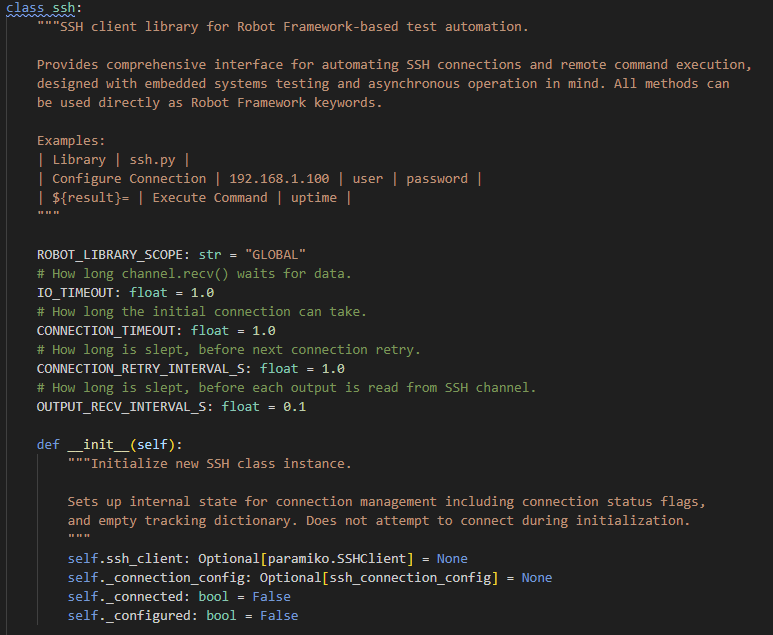
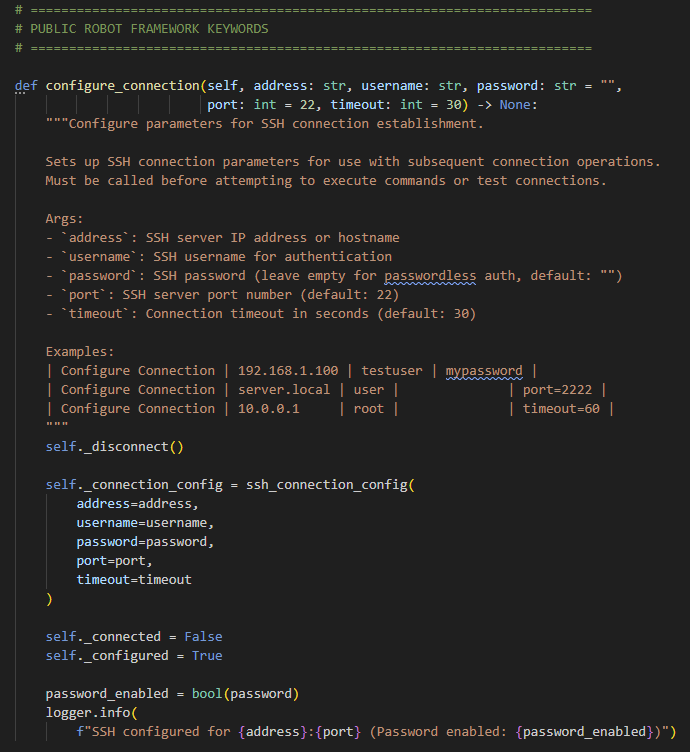
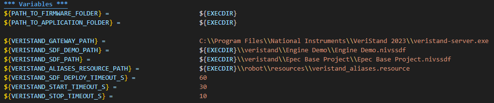
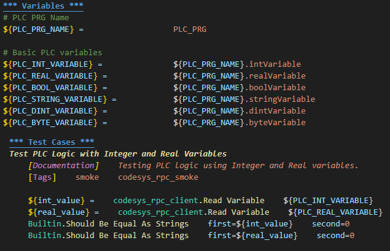
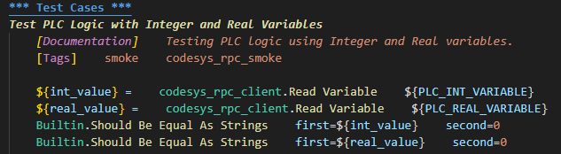
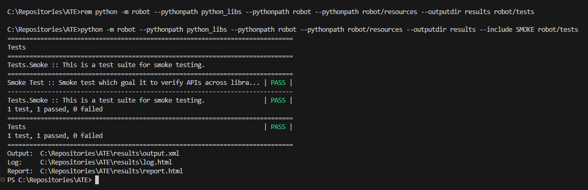
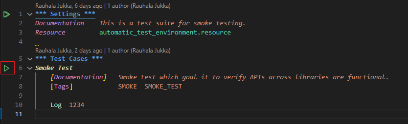
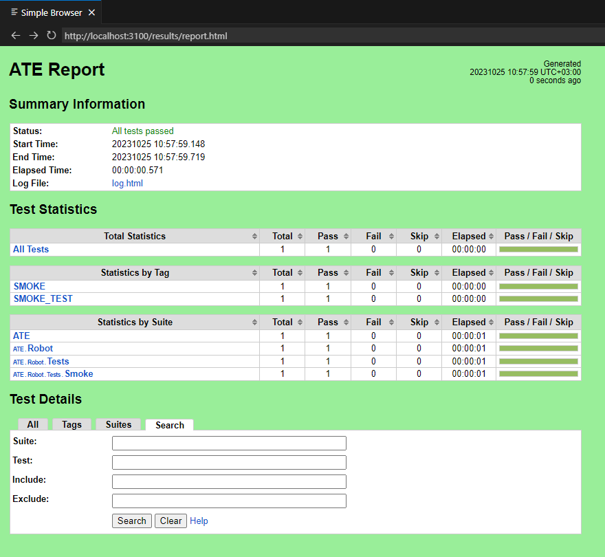
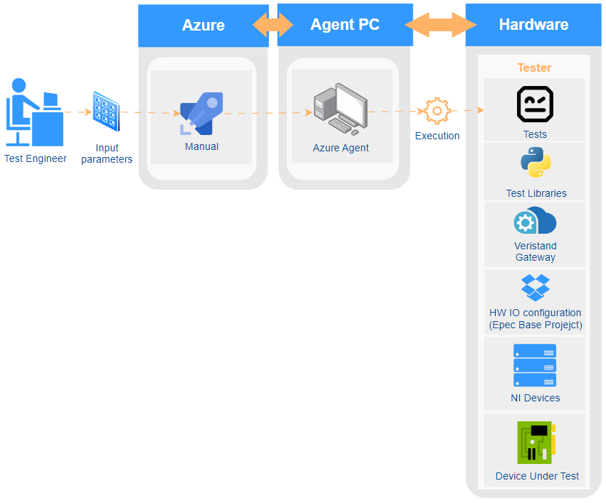
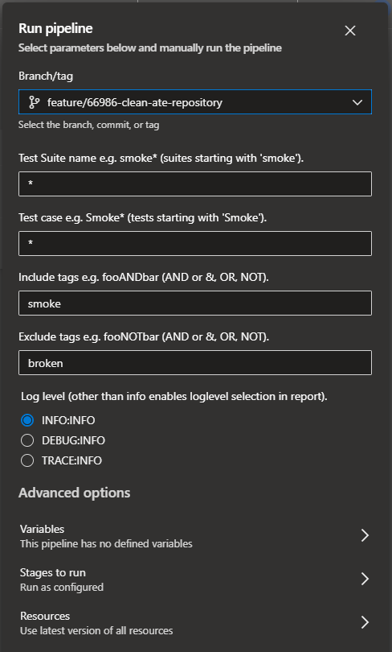

[[_TOC_]]

# Introduction

This README file gives basic guidelines how to do Robot Framework scripts and Python code.

Documentation also tries to explain and open up the best practices using Dos and Don'ts approach.

# Coding Guildelines

## Python

ATE repository uses a custom style for Python that is aligned towards Robot Framework usage. For more information please read the Python styleguide for this repository:

[Python Style Guide](PYTHON_STYLEGUIDE.md).

**Short guide:**

[LibDoc](https://robotframework-ja.readthedocs.io/ja/latest/userguide/SupportingTools/Libdoc.html) documentation style is used for python and robot, mainly because robot framework plugin fetches documentation of libraries using LibDoc.

Through documentation user should be able to get basic understanding why file is there and what is does.

- File documentation tells what file contains like class implementation for what purpose.
- Class documentation tells what class contains.
- Method documentation tell what method is for, what arguments it takes in and what it returns, if it returns anything at all.



The following example shows how python method can be documented to make it understandable for users.

- Type hinting to describe types for arguments and return values.
- Description which tells what method is doing.
- Arguments.
- Return values.

Documents within the code using '#' character is also preferred to explain certain parts of the code logic.



### Python Indentation

Visual Studio IDE is configured for Robot Framework code to automatically ident code by pressing **ALT + SHIFT + F**.

**Not good indentation:**
```
if node_id is None:
    raise ValueError("No node id given.")
ret_val = self.network.nodes[node_id].sdo[0x2032][1].raw
if ret_val == 0: return "continue to next step."
if ret_val == 170: return "unit already unlocked, download is enabled."
if ret_val == 255: return "password was wrong and reboot is required."
else: raise ValueError(f"Invalid status:{ret_val}")
```

**After indentation (ALT + SHIFT + F):**
```
if node_id is None:
    raise ValueError("No node id given.")

ret_val = self.network.nodes[node_id].sdo[0x2032][1].raw

if ret_val == 0:
    return "continue to next step."
if ret_val == 170:
    return "unit already unlocked, download is enabled."
if ret_val == 255:
    return "password was wrong and reboot is required."
else:
    raise ValueError(f"Invalid status:{ret_val}")
```

## Robot Framework

### Global Variables

Variables defined in resource file can be considered as a global variables not by specification but from usability point of view.
These are written UPPER_AND_SNAKE_CASE, so when used in Test Case in Test Suite it's known located outside of suite file and it's available during test execution for all Test Suites.



### Suite Variables

Variables defined in Test Suite are considered suite variables.
These are written UPPER_AND_SNAKE_CASE, so when used in Test Case in Test Suite user knows it's located outside of Test Case and are available during test execution for all test cases in Test Suite.



### Local Variables

Variables defined inside Test Cases can be considered as local variables not by specification but from usability point of view.
When these are written lower_and_snake_case, so when used in Test Case user knows it's located inside of test case only.



### Robot Indentation

Visual Studio IDE is configured for Robot Framework code to automatically ident code by pressing **ALT + SHIFT + F**.

**Not good indentation:**
```
Test PLC Logic with Integer and Real Variables
    [Documentation]                Testing PLC logic using Integer and Real variables.
    [Tags]  smoke        codesys_rpc_smoke

    ${int_value} =      codesys_rpc_client.Read Variable     ${PLC_INT_VARIABLE}
    ${real_value} =     codesys_rpc_client.Read Variable  ${PLC_REAL_VARIABLE}
    Builtin.Should Be Equal As Strings     first=${int_value}  second=0
    Builtin.Should Be Equal As Strings  first=${real_value}          second=0
```

**After indentation (ALT + SHIFT + F):**
```
Test PLC Logic with Integer and Real Variables
    [Documentation]    Testing PLC logic using Integer and Real variables.
    [Tags]    smoke    codesys_rpc_smoke

    ${int_value} =      codesys_rpc_client.Read Variable    ${PLC_INT_VARIABLE}
    ${real_value} =     codesys_rpc_client.Read Variable    ${PLC_REAL_VARIABLE}
    Builtin.Should Be Equal As Strings    first=${int_value}    second=0
    Builtin.Should Be Equal As Strings    first=${real_value}    second=0
```

### Dot Syntax

Using dot syntax when referring to libraries used in test sequence is not mandatory by Robot Framework but it increases usability. Robot Framework can call keywords without Dot Syntax but it will indicate an error if multiple keywords found with same name. Dot Syntax is used to explicitly refer to the library which keyword to call.

**Instead of this:**
```
Log             test log message
Read Variable   ${PLC_INT_VARIABLE}
```

**Do this:**
```
BuiltIn.Log                         test log message
codesys_rpc_client.Read Variable    ${PLC_INT_VARIABLE}
```

# Usage

ATE, Automatic Testing Environment can be used in various way.

Running it manually using batch [script](../run-tests.bat), running from IDE using [RobotCode](https://marketplace.visualstudio.com/items?itemName=d-biehl.robotcode) plugin and from Azure [pipeline](https://epectfssrv.ad.epec.fi/tfs/Epec%20Products/EnvironmentalTestingSystem/_build?definitionId=259) using manual test pipeline.

In local run using batch script or RobotCode plugin test results are generated in results folder located in the root of workspace folder.

## Batch script

User can use the batch script to execute tests.
This way it executes the pre-defined Robot Framework command.

Please note that batch [script](../run-tests.bat) needs to be modified if some tests needs to be excluded or included.

**Following is an example output from execution using a batch script:**



## RobotCode plugin

User can use RobotCode plugin to execute tests.
This way it executes the selected test suite or test case from VS Code IDE.

Please note that RobotCode plugin uses settings defined in [settings.json](../.vscode/settings.json) file.
This settings file contains necessary settings information for RobotCode plugin.

Normally this settings file don't needs to be modified and should work as is.

**To run certain test case just select test suite file and click Play button on the row of test case name:**



## Robot Framework Report

Following is an example output from execution using a batch script.

When preferred VS Code plugins are installed then report should open in VS Code right next to the robot file.



## Azure Manual Pipeline

User can use Azure [Manual Test pipeline](https://epectfssrv.ad.epec.fi/tfs/Epec%20Products/EnvironmentalTestingSystem/_build?definitionId=259) to execute tests.
This way it executes tests on ATE test PC remotely.



User can configure test execution in various way.

More information can be found from pipelines [README](../pipelines/README.md) in the chapter Manual Pipeline.


