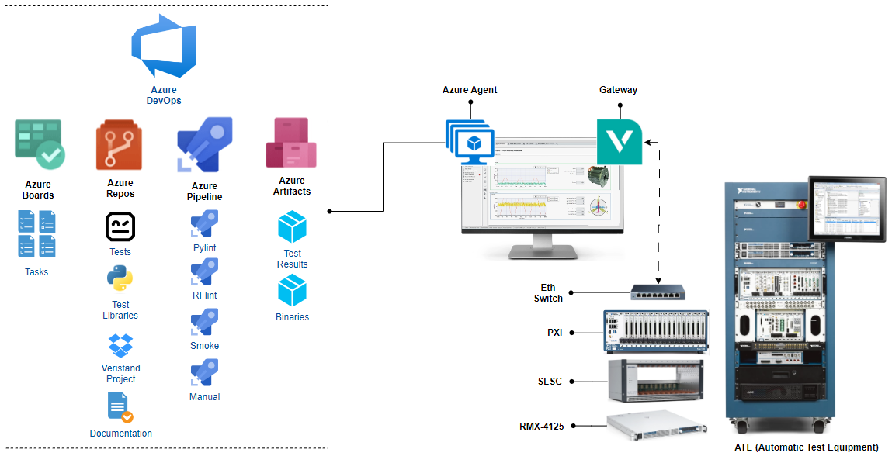
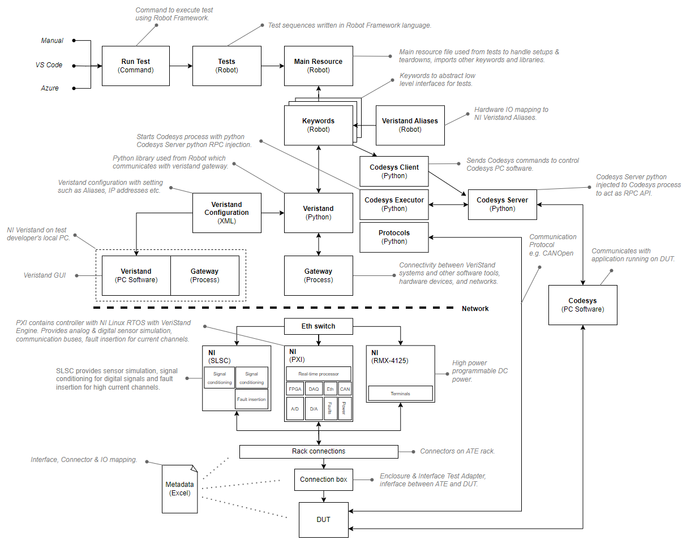

[[_TOC_]]

# Introduction

This README file describes the overall architecture of ATE.

Please also see the [guidelines](GUIDELINES.md) which gives basic general information about the best practices of Robot Framework test scripts and Python code.

Following README files describes more details about the ATE repository.

- [Main](../README.md)
- [Pipelines](../pipelines/README.md)
- [Python-libs](../python_libs/README.md)
- [Robot](../robot/README.md)
- [Veristand](../veristand/README.md)

# ATE Architecture

# ATE Components

