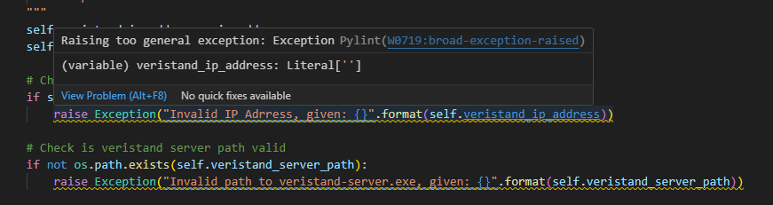
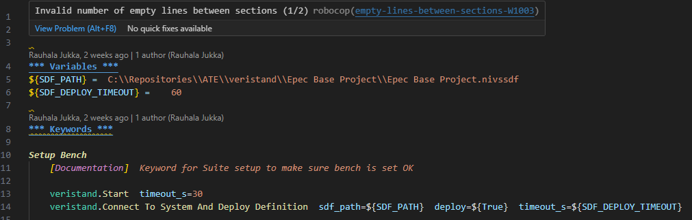
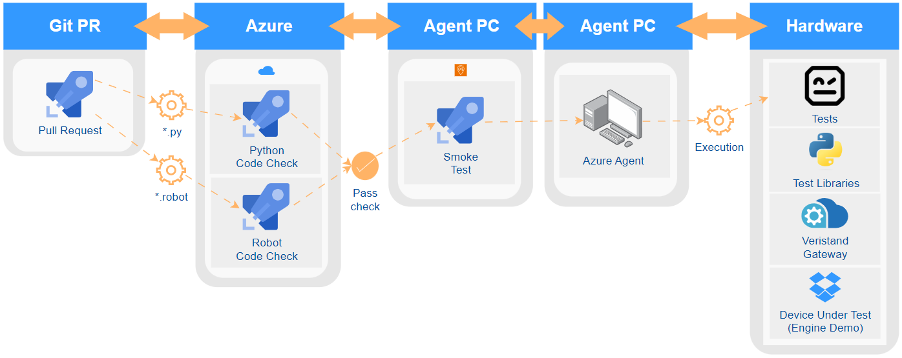
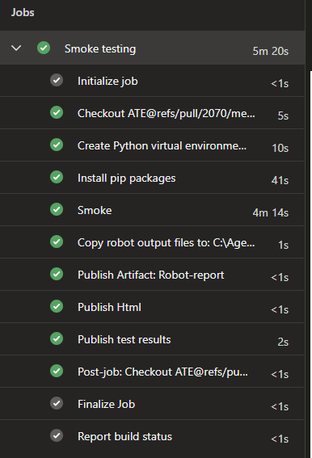
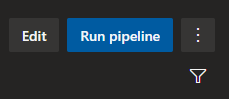
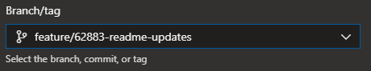

[[_TOC_]]

# Introduction

This README file describes the content and the meaning of the files located in [pipelines](.) folder.

Please see the overall architecture of ATE from main [README](../docs/README.md) file located in docs folder.

# Pipelines

The following pipelines are meant to make sure ATE meets the code quality standards and tests are easily executable from Azure.

- [Pylint](pylint.yaml)
- [RFLint](rflint.yaml)
- [Smoke Test Pipeline](pr-smoke.yaml)
- [Manual Pipeline](manual.yaml)

## PyLint

[Pylint](https://pylint.readthedocs.io/en/stable/) is a static code analyzer for Python 2 or 3. The latest version supports Python 3.8.0 and above.

Pylint analyses your code without actually running it. It checks for errors, enforces a coding standard, looks for code smells, and can make suggestions about how the code could be refactored.

When you clone ATE repository, Pylint is automatically installed and configured to VS Code editor.

**The following picture shows how errors are indicated in VS Code editor:**

## RFLint

[Robocop](https://robocop.readthedocs.io/en/stable/) is a tool that performs static code analysis of Robot Framework code.

It uses official Robot Framework parsing API to parse files and runs number of checks, looking for potential errors or violations to code quality standards (commonly referred as linting issues).

When you clone ATE repository, RFLint is automatically installed and configured to VS Code editor.

**The following picture shows how errors are indicated in VS Code editor:**

## Smoke test Pull Request pipeline

[Smoke test Pull Request pipeline](https://epectfssrv.ad.epec.fi/tfs/Epec%20Products/EnvironmentalTestingSystem/_build?definitionId=249&_a=summary) is meant to be triggered when Pull Request is done to ATE repository.

This way Azure's automatic pipeline makes sure changes made in PR don't brake anything major functionalities.

**Pipeline is not meant to be run manually.**

**The following picture shows steps from PR Smoke Test Pipeline:**

## Manual Pipeline

[Manual Test pipeline](https://epectfssrv.ad.epec.fi/tfs/Epec%20Products/EnvironmentalTestingSystem/_build?definitionId=259) is meant to be triggered manually to test changes automatically through Azure.

This way Azure's automatic pipeline makes sure changes made are tested on ATE test bench.

When queued using **Run pipeline** user can configure robot command to test changes automatically through Azure.

The following arguments can be selected when queuing pipeline.

**Branch**

**Test Suite name**

    Tests can be selected also by suite names that selects all tests in matching suites.
    Similarly as with test, given names are case, space and underscore insensitive and support simple patterns.
    To pinpoint a suite more precisely, it is possible to prefix the name with the parent suite name.

    Smoke                  # Match only suites with name 'Smoke'.
    smoke*                 # Match suites starting with 'smoke'.

**Test case**

    Can be used for selecting tests by their names.
    Given names are case, space and underscore insensitive and they also support simple patterns.

    Smoke                  # Match only tests with name 'Smoke'.
    smoke*                 # Match tests starting with 'smoke'.

**Include tags**

    Use tag patterns where * and ? are wildcards and AND, OR, and NOT operators can be used for combining individual tags or patterns.

    feature-4?
    bug*
    fooANDbar
    xxORyyORzz
    fooNOTbar

**Exclude tags**

    Use tag patterns where * and ? are wildcards and AND, OR, and NOT operators can be used for combining individual tags or patterns.

    feature-4?
    bug*
    fooANDbar
    xxORyyORzz
    fooNOTbar

**Log level**

    If the log file contains messages at DEBUG or TRACE levels, a visible log level drop down is shown in the upper right corner.
    This allows users to remove messages below chosen level from the view.
    This can be useful especially when running test at TRACE level.

    INFO:INFO
    DEBUG:INFO
    TRACE:INFO
