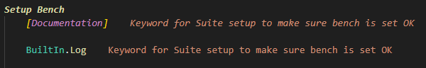
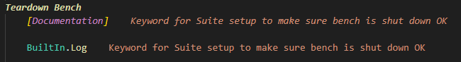
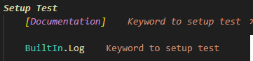
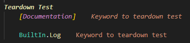
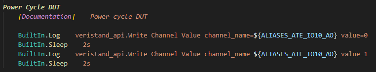
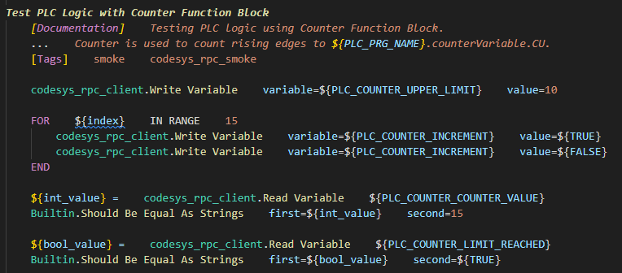

[[_TOC_]]

# Introduction

This README file describes the content and the meaning of the files located in this Robot folder.

- [Main resource file](automatic_test_environment.resource)
- [Keyword files](resources) (resources)
- [Tests](tests)

Please see the overall architecture of ATE from main [README](../docs/README.md) file located in docs folder.

# Main resource file
[Main resource file](automatic_test_environment.resource) takes care all python libraries and keyword files are imported needed in tests. This resource file also takes care that all python libraries and other keyword files are imported needed by tests in test suites.

**Basic keywords located in main resource file for tests are:**

- Setup Bench
- Teardown Bench
- Setup Test
- Teardown Test

## Setup Bench

Keyword which makes sure test bench is powered on and ready to be used.

## Teardown Bench

Keyword which makes sure test bench is safely shutdown.

## Setup Test

Keyword which makes sure connections opened so tests can start to communicate with devices.

## Teardown Test

Keyword which makes sure connections are closed to the devices used in tests.

# Keyword files

Keyword files located in [resources](resources) are mainly files meant to group certain keywords to one resource file. This way it makes command towards hardware more organized. Keywords also provides one layer more to abstract things towards tests so tests don't get too complicated.

# Tests

[Test files](tests) which are executed directly from VS Code using RobotCode plugin, batch script (.bat) located in the root of workspace or from Azure using manual test pipeline.

Test Suite files only imports main resource file and defines test cases to be executed. Good habit is to name the suite file based on the requirement / feature it tests.

