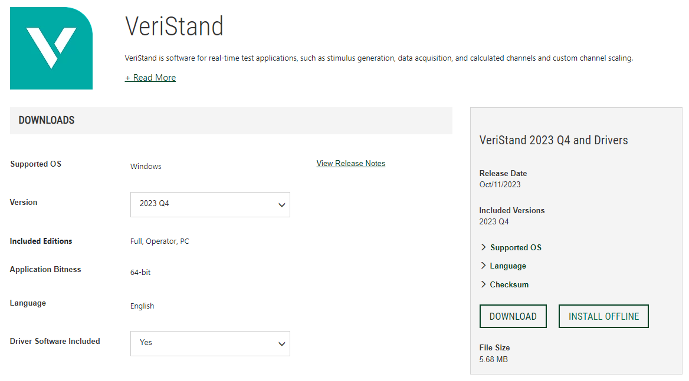
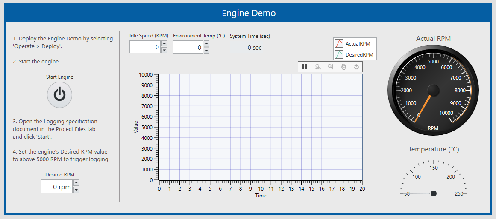
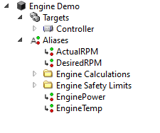
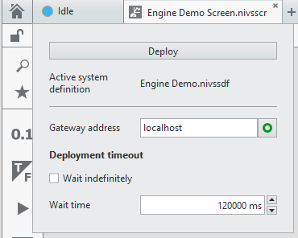
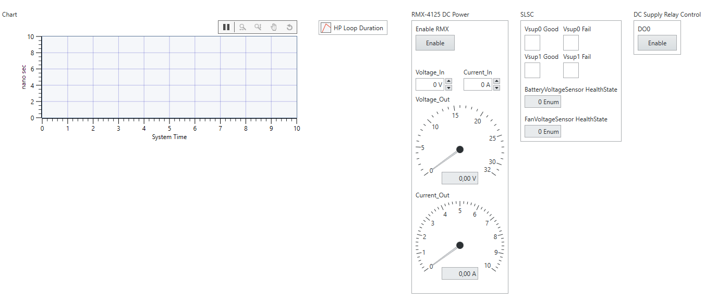
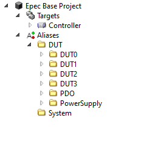

[[_TOC_]]

# Introduction

This folder contains two projects **Engine Demo** and **Epec Base Project** made using [National Instrument](https://www.ni.com/en.html)'s [Veristand](https://www.ni.com/en/shop/data-acquisition-and-control/application-software-for-data-acquisition-and-control-category/what-is-veristand.html) software.

# Veristand installation

Veristand can be [downloaded](https://www.ni.com/en/support/downloads/software-products/download.veristand.html#494536) from NI webpage.

Veristand uses gateway to communicate with demo and also with the real hardware. Gateway is running locally on PC and it communicates with demo or hardware based on the setting set in a project.

*The trial version lasts 45 days and after that it requires a license.*

# Engine Demo

## Main UI

Engine Demo is the project which is runnable on Windows without any hardware.
This is good way to get familiar with Veristand and also to test usage of the python interface called [veristand.py](../python_libs/interfaces/veristand/veristand.py).

## Aliases

Also the aliases are predefined and mapped in the project. Tests can read and write these using veristand.py Python library interface.

## Deploy

Engine Demo can be deployed from the menu. When engine demo is deployed it can immediately be used from Veristand UI.

# Epec Base Project

## Main UI

Epec Base Project is the main project which is meant to be used as a base for testing a new product. Epec Base Project contains predefined configuration e.g. aliases.

## Aliases

Also in this project the aliases are predefined and mapped in the project. Tests can read and write these using veristand.py Python library interface.

## Deploy

Deploy is handled in the same way like in Engine Demo project. Project configuration automatically contain right IP addresses to the real hardware so the gateway knows where hardware is located.

